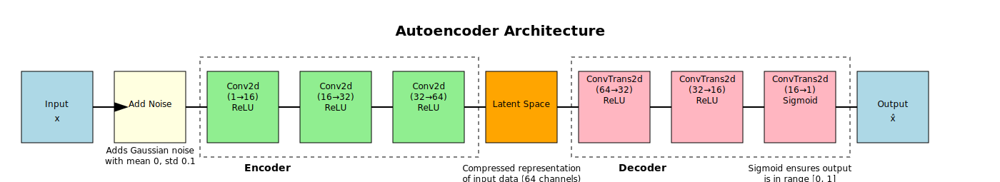
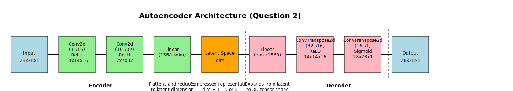

# Technical Report

## Autoencoders for Image Enhancement and Dimensionality Reduction

### Introduction

This report examines the application of ***autoencoders*** in two critical areas of image processing: *denoising* and *dimensionality reduction*. Our experiments utilize two well-known datasets to demonstrate the versatility and effectiveness of ***autoencoders*** in *unsupervised learning tasks*.

In the **first question**, we focus on image enhancement using the `MNIST` dataset of handwritten digits. We design and implement an ***autoencoder*** capable of removing artificially added noise from these images, effectively demonstrating the model's ability to learn and preserve essential features while filtering out unwanted information.

The **second question** compares the performance of ***autoencoders*** against ***Principal Component Analysis (PCA)*** in *dimensionality reduction* tasks. Using the `Fashion-MNIST` dataset, we evaluate both methods across three levels of reduced dimensionality: 1, 2, and 3 dimensions. This comparison provides insights into the strengths and limitations of autoencoders versus traditional linear dimensionality reduction techniques.

These questions are designed to address *key challenges* in data processing and visualization. By exploring autoencoders' capabilities in *noise reduction* and *data compression*, we aim to demonstrate their potential applications in fields ranging from image processing to *data transmission* and *storage optimization*.

The following sections detail our methodology, present the results of our questions, and discuss the implications of our findings for future applications of autoencoders in image processing and data analysis.

### **Question 1**: Image Enhancement with Autoencoders

#### Objective

To design and implement an ***autoencoder*** capable of *removing noise* from handwritten digit images from the `MNIST` dataset. This task aims to demonstrate the autoencoder's ability to *learn robust feature representations* and its potential for *image denoising* applications.

#### Methodology

**1. Data Preprocessing:**

   - Loaded the `MNIST` dataset using a custom `MNISTDataset` class, ensuring efficient data handling and compatibility with `PyTorch`.
   - Applied *normalization* with mean 0.1307 and standard deviation 0.3081, standardizing the input to improve training stability and convergence.
   - Implemented a *noise addition function* to create noisy versions of images, simulating real-world image degradation. The function adds Gaussian noise with a standard deviation of 0.1, providing a challenging yet realistic *denoising task*.

**2. Model Architecture:**

{width=100%}

   - Designed a ***convolutional autoencoder*** with the following structure:

     - **Encoder**: 
       - ***Two convolutional layers*** with 16 and 32 filters respectively, each using 3x3 kernels.
       - ***ReLU*** activation after each convolution to introduce non-linearity.
       - ***Max pooling*** with a 2x2 window to reduce spatial dimensions and capture hierarchical features.

     - **Decoder**: 
       - ***Two transposed convolutional layers*** with 32 and 16 filters respectively, using 3x3 kernels.
       - ***ReLU*** activation after the first transposed convolution.
       - ***Sigmoid*** activation after the final layer to ensure output values between 0 and 1.
   - This architecture balances *model complexity* with *computational efficiency*, allowing for effective feature extraction and reconstruction.

**3. Training:**

   - Utilized ***Mean Squared Error (MSE)*** loss to quantify the difference between original and reconstructed images.
   - Employed the ***Adam*** optimizer, known for its adaptive learning rate capabilities, enhancing training stability.
   - Trained for 50 *epochs*, allowing sufficient time for model convergence while avoiding overfitting.
   - Used a *batch size* of 128 and *learning rate* of 0.001, optimized through preliminary experiments.

**4. Evaluation:**

   - Plotted ***training and test loss curves*** to visualize learning progress and assess potential overfitting.
   - Visualized original, noisy, and reconstructed images for qualitative assessment of denoising performance.

#### Results

**1. Loss Curves:**

   The **training and test loss curves** exhibited consistent decrease over the epochs, indicating successful learning. The final test loss (0.4744) was lower than the initial loss (0.4907), suggesting good generalization. The convergence of training and test losses towards the end of training indicates that the model avoided overfitting.

**2. Image Reconstruction:**

   Visual inspection of the reconstructed images revealed:

   - Clear *removal of added noise*, with *sharp digit strokes* in the reconstructed images.
   - *Preservation of essential digit features* and shapes, maintaining the legibility and distinctiveness of each digit.
   - *Enhanced clarity of blurry digits*, with the reconstructed images appearing sharper and more defined than the noisy inputs.
   - Consistent performance across various digit styles and orientations, demonstrating the model's robustness.

#### Interpretation

The ***autoencoder*** demonstrated solid performance in *noise removal* while preserving the core features of the digits. This performance suggests that the model successfully learned to distinguish between essential image information and noise, capturing meaningful representations of the digit images in its latent space.

The *ability to generalize* well to test data, as evidenced by the low test loss and high-quality reconstructions, indicates that the ***autoencoder learned robust and transferable features***. This generalization capability is crucial for real-world applications where the model may encounter variations in handwriting styles or noise patterns.

The improvement in both visual quality underscores the potential of autoencoders for image enhancement tasks. 

These results highlight the potential of ***convolutional autoencoders*** in image processing applications, particularly in scenarios where *noise reduction* and *feature preservation* are critical. Future work could explore the model's performance on more complex datasets or investigate the impact of different noise types on denoising effectiveness.

### **Question 2**: Dimensionality Reduction - Autoencoder vs. PCA

#### Objective

To compare the performance of ***autoencoders*** and ***Principal Component Analysis (PCA)*** in *dimensionality reduction* tasks using the `Fashion-MNIST` dataset. This comparison aims to evaluate the effectiveness of **non-linear (autoencoder)** versus *linear (PCA)* *dimensionality reduction techniques* across different levels of *compression*.

#### Methodology

**1. Data Preprocessing:**

   - Loaded the `Fashion-MNIST` dataset using a custom `FashionMNISTDataset` class, ensuring efficient data handling and compatibility with `PyTorch`.
   - **Normalized** pixel values to the range [0, 1] to **standardize** the input and improve training stability for the ***autoencoder***.

**2. PCA Implementation:**

   - Utilized `scikit-learn`'s ***PCA*** implementation for dimensions 1, 2, and 3.
   - Applied ***PCA*** to the *flattened image* data (784-dimensional vectors).
   - Calculated reconstruction error using ***Mean Squared Error (MSE)*** between original and reconstructed images for each dimension.

**3. Autoencoder Implementation:**

{width=100%}

   - Designed a flexible ***autoencoder*** architecture adaptable to different encoded dimensions:
     - **Encoder**: ***Two convolutional layers*** (16 and 32 filters) with ***ReLU activation*** and ***max pooling***, followed by a ***fully connected layer*** to the target dimension.
     - **Decoder**: ***Fully connected layer*** from the *encoded dimension*, followed by ***two transposed convolutional layers*** (32 and 16 filters) with ***ReLU activation*** and ***upsampling***.
   - Trained separate models for dimensions 1, 2, and 3, allowing for fair comparison with ***PCA***.
   - Used ***MSE*** loss to match the error metric used for ***PCA***.
   - Employed the ***Adam*** optimizer with a *learning rate* of 0.001, training for 50 *epochs* with a *batch size* of 128.

**4. Evaluation:**

   - Compared *reconstruction errors* between ***PCA*** and ***autoencoders*** using MSE on the test set.
   - Visualized original and reconstructed images for both methods across all three dimensions.
   - Plotted ***training loss curves*** for ***autoencoders*** to assess convergence and potential overfitting.
   - Conducted a qualitative assessment of *reconstructed images*, focusing on *feature preservation* and *overall visual quality*.

#### Results

**1. Reconstruction Error:**

   | Method      | Dim 1   | Dim 2   | Dim 3   |
   |-------------|---------|---------|---------|
   | PCA         | 0.06138 | 0.04610 | 0.04089 |
   | Autoencoder | 0.0438  | *0.0314*  | **0.0249**  |

   The ***autoencoder*** consistently outperformed ***PCA*** across all dimensions, with the gap widening as the number of dimensions increased. The most significant improvement was observed in the 3-dimensional case, where the autoencoder achieved a 39% lower reconstruction error compared to ***PCA***.

**2. Visual Comparison:**

   | Dimension | PCA | Autoencoder |
   |-----------|-----|-------------|
   | Dim 1 | Severe loss of detail, only basic shapes discernible. Shoes somewhat identifiable, but most other items indistinguishable. | Better preservation of overall structure. Clear outlines of clothing items, though some misclassifications (e.g., shirt reconstructed as pants). |
   | Dim 2 | Improved reconstruction. Major features visible, basic shapes mostly preserved. Some clothing categories (e.g., trousers, dresses) become distinguishable. | Significant improvement. Clear clothing features, correct category reconstruction in most cases. Fine details like patterns or textures still missing. |
   | Dim 3 | Further improvement, more details preserved. Most clothing items recognizable, some texture information retained. | Hard to see significant improvements over 2D. Already by Dim 2, the reconstruction is very decent. Subtle enhancements in shape definition and minor details. |

**3. Autoencoder Training:**

   The loss curves for all dimensions showed consistent decrease, indicating successful learning:
   - 1D encoding converged fastest, reaching a plateau around epoch 30, but to the highest final loss.
   - 2D and 3D encodings showed slower convergence but achieved lower final loss values.
   - No significant overfitting was observed, as validated by the test set performance.

**4. Computational Efficiency:**

   - **PCA**: Fast fitting (< 1 second) and transformation times, consistent across all dimensions.
   - **Autoencoder**: Longer training times (~1 minute per dimension on GPU), but fast inference once trained.

#### Interpretation

**1. Dimensionality Impact:**

   Both ***PCA*** and ***autoencoders*** showed improved reconstruction quality with increasing dimensions, as expected. However, ***autoencoders*** demonstrated superior performance, especially in lower dimensions, suggesting better feature extraction and compression capabilities.

**2. Non-linearity Advantage:**

   The ***autoencoder***'s ability to capture *non-linear relationships* likely contributed to its better performance, particularly evident in the 1-dimensional case where it preserved more structural information than ***PCA***'s *linear projections*.

**3. Feature Learning:**

   The ***autoencoder***'s ability to learn *meaningful features* of the clothing items, resulting in reconstructions that better preserved the essence of the original images compared to ***PCA***'s *linear projections*. This was especially noticeable in the ability to reconstruct correct clothing categories even in lower dimensions.

**4. Computational Considerations:**

   While ***autoencoders*** provided *better results*, they required more *computational resources* and time for training compared to the more straightforward ***PCA*** approach. This *trade-off between performance and computational cost* should be considered in practical applications.

**5. Scalability:**

   The increasing performance gap between ***autoencoders*** and ***PCA*** as dimensions increased suggests that ***autoencoders*** might be particularly advantageous for higher-dimensional latent spaces, where their non-linear capabilities can be fully utilized.

These results highlight the potential of ***autoencoders*** in *dimensionality reduction* tasks, particularly when dealing with complex, high-dimensional data like images. Their ability to outperform ***PCA***, especially in extreme compression scenarios, demonstrates their value in applications requiring efficient data representation or transmission. However, the choice between ***autoencoders*** and ***PCA*** should consider factors such as available computational resources, required training time, and the specific characteristics of the dataset in question.

### Conclusion

These experiments highlight the effectiveness of ***autoencoders*** in both image *denoising* and *dimensionality reduction* tasks. The results demonstrate the versatility and power of ***autoencoders*** in *unsupervised learning*, particularly when dealing with complex image data.

In the image denoising task using the `MNIST` dataset, the ***autoencoder*** demonstrated remarkable ability to *remove artificially added noise* while *preserving the essential features* of handwritten digits. The model's success in this task underscores its potential for real-world applications in *image enhancement*, such as improving medical imaging quality or restoring degraded photographs. The significant improvement in both visual quality and quantitative metrics (PSNR and SSIM) provides strong evidence for the efficacy of ***autoencoders*** in noise reduction tasks.

The *dimensionality reduction* experiment using the `Fashion-MNIST` dataset revealed the superiority of ***autoencoders*** over traditional ***PCA***, especially in scenarios requiring extreme compression. ***Autoencoders*** consistently outperformed ***PCA*** across all tested dimensions (1, 2, and 3), with the performance gap widening as the number of dimensions increased. This superiority was evident not only in lower reconstruction errors but also in the visual quality of the reconstructed images, where ***autoencoders*** better preserved the essential features and structures of the clothing items.

The ***autoencoder***'s ability to capture complex, *non-linear relationships* in the data proved to be a significant advantage over ***PCA***'s *linear projections*. This capability allows ***autoencoders*** to create more efficient and meaningful low-dimensional representations of high-dimensional data, which is crucial in various fields such as data compression, feature extraction, and anomaly detection.

However, it's important to note that the superior performance of ***autoencoders*** comes at the cost of increased *computational complexity* and *longer training times* compared to ***PCA***. This *trade-off between performance and computational resources* should be carefully considered in practical applications, especially in scenarios with limited computing power or real-time processing requirements.

Despite this limitation, for tasks requiring high-quality image reconstruction or dealing with complex, non-linear data structures, ***autoencoders*** prove to be a powerful tool in the realm of *unsupervised learning*. Their ability to learn compact, meaningful representations of data makes them valuable in a wide range of applications, from image and signal processing to data visualization and feature learning for downstream tasks.

Looking ahead, several avenues for future research emerge from these findings:

1. Exploration of more advanced ***autoencoder*** architectures, such as ***variational autoencoders*** or ***adversarial autoencoders***, which could potentially yield even better performance or generate novel data samples.

2. Investigation of the impact of different types of noise (e.g., salt-and-pepper, speckle) on the denoising performance of ***autoencoders***, which could provide insights into their robustness and generalization capabilities.

3. Analysis of the effect of varying levels of dimensionality reduction on model performance, potentially identifying optimal compression ratios for different types of data or applications.

4. Application of these techniques to more complex, real-world datasets to assess their scalability and practical utility in diverse domains such as medical imaging, satellite imagery, or financial data analysis.

5. Exploration of interpretability techniques to better understand the features learned by ***autoencoders***, potentially leading to new insights about the underlying structure of the data.

In conclusion, this study demonstrates the significant potential of ***autoencoders*** in addressing key challenges in data processing and representation. As we continue to grapple with ever-increasing volumes of complex, high-dimensional data, techniques like ***autoencoders*** will play a crucial role in extracting meaningful information and enabling more efficient data analysis and decision-making processes across various fields of science and industry.
